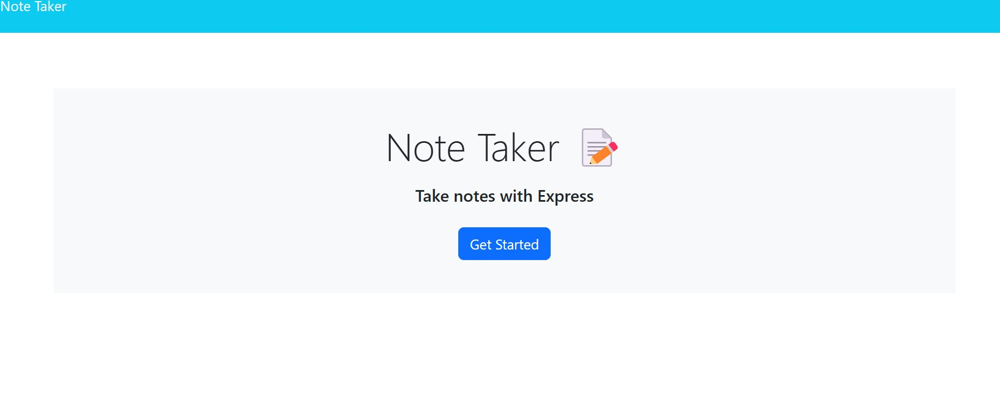
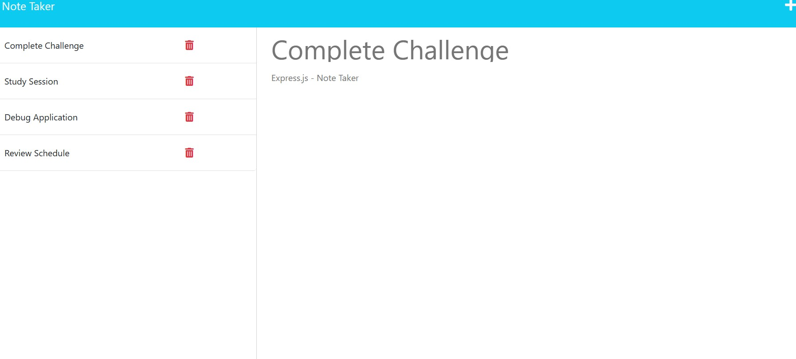

# Note Taker - Express.js

## My Task

My assignment was to modify a starter code and use Express.js and back end strategies to create an application called Note Taker. This application can be used to write and store notes considering that input is saved and can be retrieved from a JSON file.

The application only required new back end development because all of the front end was already taken care and created. My job was to construct back end, connect it, and then deploy it to Heroku.

## User Story

```
AS a business professional
I WANT to be able to write and store ideas
SO THAT I can efficiently track objectives and organize my thoughts through a note taking system 
```

## Acceptance Criteria

```
GIVEN a application for note taking
WHEN I press Get Started on the landing page
THEN that links me to a notes page where I am presented with notes that are currently listed on the left-hand side in a column and on the right-hand side there is an input option for new note's
WHEN I enter a new note title and text
THEN a save icon appears in the navigation bar at the top of the page
WHEN I click save after I have inputted
THEN in that column on the left-hand side my input title appears at the bottom of the notes list
WHEN I click on an existing note
THEN I am presented with the title and the text on the right-hand side
WHEN I click on the plus sign in the navigation bar THEN the right-hand side input column resets and I can enter new notes again
```

## Mock Up

The following images show a Mock Up example of the web application's appearance and functionality that helped guide me along in this Challenge:


## Getting Started

I have included a `db.json` file since this is a back end application I used the `fs` module to store and retrieve notes.

The following lists the HTML routes that I have created:

* `GET /notes` that returns the `notes.html` file.

* `GET *` that returns the `index.html` file.

The following lists the API routes that that I have created:

* `GET /api/notes` that reads the `db.json` file and returns all saved notes as JSON.

* `POST /api/notes` that receives the new notes that save on the request body, adds to the `db.json` file, and then returns the new notes to the client. I have given each note a unique id for when it's saved.

## Bonus

Despite not yet learning how to handle DELETE requests this application offers the option to delete a note that is already existing. That functionality is taken care of the front end and just needed to be connecting to the back end. As a bonus I have routed the DELETE functionality of this application.

* `DELETE /api/notes/:id` receives a query parameter that contains the id of a note to delete. To delete a note, the user must click the red trashcan icon on the chosen note and it will be deleted.

## Review 

The following has been placed here to meet requirements for review:


Refer to this link [Heroku Deployed Application](https://note-taker-kg-951a3d82ef43.herokuapp.com/) to view and explore the application and functions on deployed site on Heroku

Refer to this link [GitHub Repository](https://github.com/TheKhalidGibson/NoteTaker) to view and explore the GitHub repo for this assignment


## Screenshots

The following images reflect the functionality and final results of development for this deployed application:








